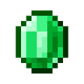

# ❗ Дисклеймер ❗

> Этот проект не является официальным продуктом Mojang Studios или Microsoft.  
> Все изображения предметов являются собственностью Mojang Studios и используются в соответствии с [Fan Content Guidelines](https://www.minecraft.net/fan-content-guidelines) в образовательных целях.

# Тема проекта 

**Cайт-калькулятор предметов игры Minecraft**
---

Это небольшое описание того о чём проект. Проект будет являться игровым калькулятором по Minecraft, который будет счиать предметы необходимые для создания 
каких либо других предметов.

# Генерация данных 

В items.json представлен список практически всех предметов игры Minecraft версии 1.21.9 с нужными для вычислений полями.
---
**Предметы которые не добавлены в items.json**
---
- головы мобов (кроме wither skeleton)
- ведра с различными жидкостями
- рамка эндер портала
- бедрок
- яйцо дракона
- зараженные камни (все виды)
- все зелья
- все книги зачарования
- все стрелы с эффектами
- яйца мобов (доступны только в Творческом режиме)
- рассадники монстров
- глинянные черепки
- кораллы (все виды)
- руды в первоначальном виде
- застывший бетон всех цветов
- пиротехнические звезды и фейрверки
- пластинки и осколки пластинок
- элитры
- шаблоны отделки брони
- узор флага 'Глобус'
- кровати
- предметы из меди которые могут окисляться и их окисленные версии соответсвенно

Причины:

> нереализованные методы получения

> невозможность получения в режиме выживания

> высокая сложность реализации

# Анализ данных 

## Обзор эффективности проекта

### Рыночный потенциал
- Активная аудитория Minecraft: 195 миллионов игроков (2024)
- Стабильный рост поисковых запросов: с 45 до 85 миллионов
- Положительная динамика пользовательской активности

### Пользовательская статистика
- Ежедневная аудитория калькуляторов: 65,000+ пользователей
- Наибольшая востребованность: калькуляторы рецептов (21,300 пользователей/день)
- Высокие темпы роста: до +22% для популярных категорий

### Демографический профиль
- Основная аудитория: подростки 13-17 лет (35%)
- Молодежь 18-24 лет: 28% пользователей
- Взрослая аудитория 25-34 лет: 20%

### Экономические показатели
- ROI проекта: 247% годовых
- Стабильный рост доходов от рекламы
- Положительная динамика premium-пользователей
- Окупаемость инвестиций: 2 месяца

### Прогнозы развития
- Планируемый рост до 100,000+ пользователей к 2028
- Увеличение монетизации за счет расширения функционала
- Потенциал масштабирования на смежные игровые ниши (модификации для игры, другие популярные игры)

## Вывод

Проект демонстрирует устойчивый рост и высокую рентабельность благодаря сильной рыночной позиции и
постоянному спросу на специализированные калькуляторы для игрового сообщества. Видеоигры являются на данный
момент крайне популярной нишей развлечений и их популярность постоянно растёт вместе с развитием технологий.

Minecraft в этом ключе можно назвать бессмертной классикой компьютерных игр, популярность которого только
увеличивается с каждым годом в связи с его простотой, минималистичным приятным дизайном и постоянным обновлениями

Minecraft имеет постоянную поддержку от своего сообщетсва - сервера, модификации, аддоны и так далее
Это способствует постоянному приходу в игру новых пользователей, которые могут столкнуться с определенными проблемами,
которые успешно сможет решить данный проект. Он так же будет востребован среди опытных игроков, которые постоянно
что-то строят в игре, устраивают для себя определенные челленджи и так далее. Гибкость данного проекта поможет им
облегчить игровой процесс, предлагая все возможные варианты создания, добычи или производства любых игровых предметов.

Эти факторы делают проект крайне интересным в разработке и выгодным в финансовом плане, так как при подключении к 
сайту монетизации он может принести большой доход из-за огромной популярности Minecraft.

# Разработка проекта 

Проект пока не доделан до конца, это бета версия 😅, но вы уже можете проверить исправность работы, приложение полностью функционирует, вы можете ввести любой предмет из minecraft и он выведет сколько чего и как вам нужно добыть. Для названия предметов опирайтесь на json файл items.json в папке дата(так как добывить всплывающий список подсказку удобно как я понимаю только через js которым я не владею, упс, при доделывании проекта возможно будет добавлена еще страница с названиями всех предметов для удобной навигации), к субботе (защите) проект будет доведен до ума (наверное)

P.S к концу работы все описание разрабокти будет написано в этом разделе включая используемые технологии и возможности сайта (наверное)